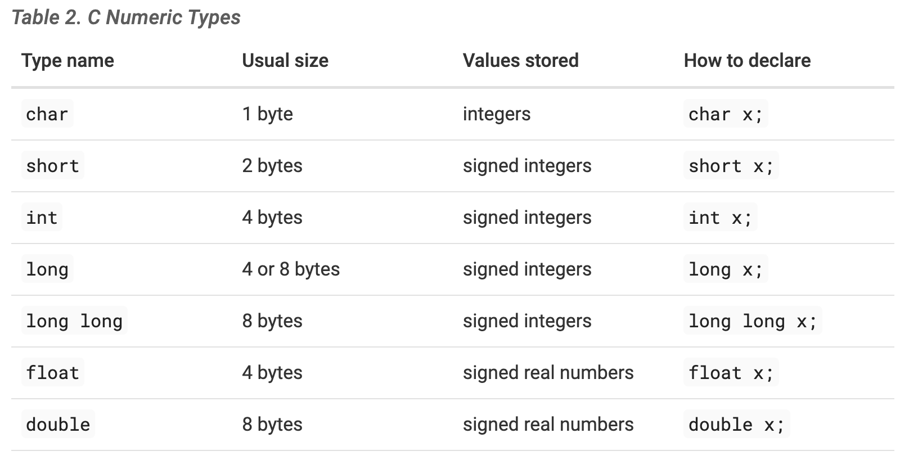

# Reading 1
- C program is expressed as a sequence of statements (steps)
- C programs are structured as a set of functions (procedures)
- Must have the main function
- C doesn’t have support for object-oriented programming
## 1.1
 - C version might be put in a file named `hello.c`
```
/*
    The Hello World Program in C
 */

/* C math and I/O libraries */
#include <math.h>
#include <stdio.h>

/* main function definition: */
int main() {
    // statements end in a semicolon (;)
    printf("Hello World\n");
    printf("sqrt(4) is %f\n", sqrt(4));

    return 0;  // main returns value 0
}
```

Difference between python and C:

- In C, multiline comments begin with `/*` and end with `*/`, and single-line comments begin with `//`
- In C, libraries are included (imported) using `#include`. All `#include` statements appear at the top of the program, outside of function bodies.
- In C, blocks (for example, function, loop, and conditional bodies) start with `{` and end with `}`.
- In C, `int main(){ }` defines the main function. The `main` function returns a value of type `int`, which is C’s name for specifying the signed integer type (signed integers are values like -3, 0, 1234). The main function returns the int value 0 to signify running to completion without error.
- In C, each statement ends with a semicolon`;`. In C, statements must be within the body of some function (in `main` in this example).
- In C, the `printf` function prints a formatted string. Values for the placeholders in the format string are additional arguments separated by commas (for example, the value of sqrt(4) will be printed in place of the `%f` placeholder in the format string).
- C’s `printf` function doesn’t automatically print a newline character at the end like Python’s print function does. As a result, C programmers need to explicitly specify a newline character (`\n`) in the format string when a newline is desired in the output.

The `main` function:
- must have a function named `main` and must have return type `int`
- explicit `return` to return an `int` value
- `main` function is automatically called when the C program executes.

1.1.1
- A C compiler is a program that translates C source code into a binary executable form
- GCC -- GUN C Compiler
```
$ gcc hello.c
$ ./a.out
```
- First compile to a.out, then direct excution of a.out

Steps for editing, compiling, and running a C program on a Unix system:
1) Using a text editor (for example, vim), write and save your C source code program in a file (e.g., hello.c):
`$ vim hello.c`
2) Compile the source to an executable form, and then run it. The most basic syntax for compiling with `gcc` is:
`$ gcc <input_source_file>`
3) The compiler creates a binary executable file named `a.out`.
The compiler also allows you to specify the name of the binary executable file to generate using the -o flag:
`$ gcc -o <output_executable_file> <input_source_file>`

1.1.2
- To declared a variable:
`type_name variable_name;`
- basic C types: `char`, `int`, `float`, and `double`
```
char letter;
letter = 'A';        // a single quote is used for single character value
letter = letter + 1; // letter stores 'B' (ASCII value one more than 'A')
```

1.1.3
- the `float` and `double` types can represent real values
- `int` represents signed integer values
- unsigned `int` represents unsigned integer values.
```
int x;           // x is a signed int variable
unsigned int y;  // y is an unsigned int variable
```
- signed: positive, negative, 0
- unsigned: non-negative
- minimum(common) size



-The `sizeof` operator evaluates to an unsigned long value, so in the call to printf, use the placeholder `%lu` to print its value.

```
x = 6;
y = ++x + 2;  // y is assigned 9: increment x first, then evaluate x + 2 (9)

x = 6;
y = x++ + 2;  // y is assigned 8: evaluate x + 2 first (8), then increment x
```

## 4.1
- 10进制：
```
(dN-1 × 10^N-1)+(dN-2 × 10^N-2)+ … +(d2 × 10^2)+(d1 × 10^1)+(d0 × 10^0)
```


 
 
